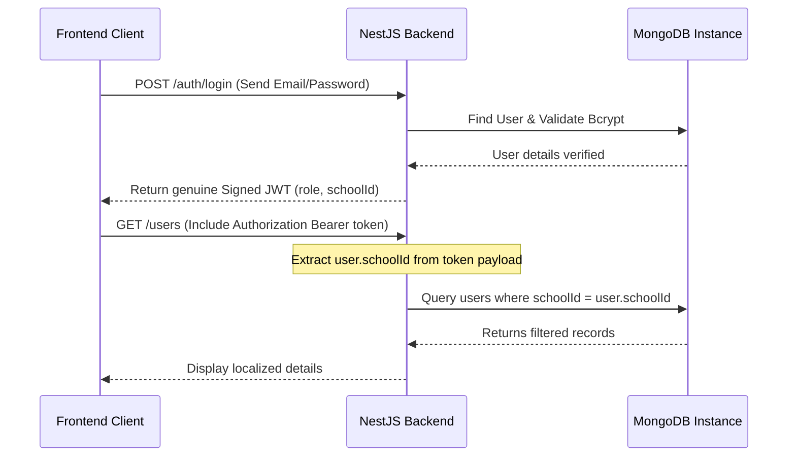

# School ERP SaaS Platform
## Technical Audit & Implementation Report (Frontend & Backend)

---

## 1. Executive Summary

This report delivers a thorough security, architectural, and logical analysis of the current **School ERP Multi-Tenant SaaS** codebase. 

While the system contains a well-defined backend framework (NestJS 11 + MongoDB) and an elegant dashboard interface (Next.js 16 + React 19 + Tailwind v4), there exists a **critical disconnect between the frontend app logic and backend REST endpoints**, along with several **severe multi-tenancy isolation and authorization flaws** in the backend.

---

## 2. Completed Modules vs. Incomplete Modules

### 🟢 Completed Modules
* **Database Modeling (Backend)**: Basic schemas for [School](file:///c:/Users/schan/OneDrive/Desktop/saas/school-erp-frontend/src/app/schools/page.tsx#13-29), [User](file:///c:/Users/schan/OneDrive/Desktop/saas/school-erp-backend/src/users/schemas/user.schema.ts#6-38), and [Activity](file:///c:/Users/schan/OneDrive/Desktop/saas/school-erp-backend/src/stats/schemas/activity.schema.ts#6-20) are implemented with Mongoose.
* **Authentication Infrastructure (Backend)**: Passports-based JWT strategy and JwtAuthGuard exist in the codebase.
* **Database Seeding Context ([seed.ts](file:///c:/Users/schan/OneDrive/Desktop/saas/school-erp-backend/src/seed.ts))**: Seeding pipelines generate mock schools, staff accounts, and activities.
* **Interactive UI Templates (Frontend)**: Rich pages exist for Login, Register steps, School overview lists, User management panels, Billing details, and System setting forms.
* **API Documentation**: Automated Swagger setup at `/api/docs` with Bearer auth configurations.

### 🔴 Incomplete Modules / Gaps
* **Frontend-Backend Decoupling (Mock Data Dependency)**:
  * The frontend components are currently **100% mocked** and do not connect to the backend APIs.
  * In [login/page.tsx](file:///c:/Users/schan/OneDrive/Desktop/saas/school-erp-frontend/src/app/login/page.tsx), the system bypasses backend services using [resolveMockCredential](file:///c:/Users/schan/OneDrive/Desktop/saas/school-erp-frontend/src/lib/auth.ts#157-163) and issues a static mock JWT token (`mock-jwt-token-12345`).
  * Pages like `/schools` and `/users` load state from static constants (`INIT_SCHOOLS`/`INIT_USERS`) rather than querying the database.
* **Inconsistent Role-Naming Mappings**:
  * Backend role schemes use space-separate strings (`'System Admin'`, `'School Admin'`).
  * Frontend role schemas use space-separated strings but maps admin credentials to different keys (`'Super Admin'` and `'Admin'`), causing JSON mapping issues.
* **Platform Admin vs. School Admin View Differentiation**:
  * Currently, the dashboard templates are identical for both roles. A logged-in `School Admin` can view the `/schools` page and view stats for all schools, which is a logic separation failure.

---

## 3. Security Analysis: Multi-Tenancy & RBAC Gaps

We have identified high-risk vulnerabilities related to data access control and role check validations:

### ⚠️ Vulnerability 1: Missing Route Protection (Authentication Gaps)
Outside `/auth/me`, **none** of the REST endpoints in the controllers contain guards.
* **Impact**: External requests can fetch all users (`GET /users`), delete a school (`DELETE /schools/:id`), or modify records (`PUT /users/:id`) anonymously without providing headers.

### ⚠️ Vulnerability 2: Unauthorized Cross-Tenant Querying (Lack of logical separation)
In `users.controller.ts`, queries are filtered by query parameters instead of JWT claims.
```typescript
@Get()
findAll(@Query('schoolId') schoolId?: string) { ... }
```
* **Impact**: A authenticated user from School A (e.g., `schoolId: 'SCH001'`) can issue a query parameter request `GET /users?schoolId=SCH002` and pull sensitive logs of School B.

### ⚠️ Vulnerability 3: Cross-Tenant Data Manipulation
Modification and deletion endpoints do not verify resource ownership.
`PUT /users/:id` updates any document ID corresponding to the matching query.
* **Impact**: A bad actor logged under School A can issue updates targeting user identifiers belonging to School B, leading to compromise.

### ⚠️ Vulnerability 4: Activity Log Leakage
The `Activity` schema lacks a `schoolId` tag.
* **Impact**: Activity tracking for all tenants is co-mingled in a single collection. Global dashboards or recent activity feeds are leaked across all schools.

---

## 4. Separation of Responsibilities

The system requires clear isolation of duties between the SaaS Platform Administrator (Owner) and School Administrators.

| Privilege Area | Platform Admin (`System Admin`) | School Admin (`School Admin`) |
|---|---|---|
| **SaaS Dashboard** | Cross-tenant metrics (active schools, total revenue) | Local school metrics (local students, local staff) |
| **School Management** | Register, upgrade, suspend, and delete tenant schools | Read own school profile only |
| **User Directory** | Add/Remove system-wide operators | Crud local teachers and staff |
| **Audit Logs** | Global system audit checks | Own institution activities only |

---

## 5. Actionable Roadmap & Fixes (Suggested Actions)



### Step 1: Secure Backend Controllers (Guard Enforcements)
1. Add `@UseGuards(JwtAuthGuard, RolesGuard)` globally or specifically to `UsersController`, `SchoolsController`, and `StatsController` endpoints.
2. Annotate admin-only functions with roles decorators (`@Roles('System Admin')`).

### Step 2: Implement True Multi-Tenancy Resolution
1. Create a custom parameter decorator `@CurrentUser()` to pull decoded JWT payload details from Requests.
2. Modify query logic in `UsersService` to dynamically enforce:
   * If the user's role is `School Admin`, restrict queries to their JWT claim `schoolId`.
   * Only allow `System Admin` to provide custom query parameters for other schools.
3. Validate ID targets in `update` and `delete` actions:
   * Perform database verify checks checking that the targeted user document owns the same `schoolId` matches the requester, preventing cross-tenant breaches.

### Step 3: Implement Database Schema Enhancements
1. Update `Activity` schema to store/index a `schoolId` field (`schoolId: { type: String, required: true }`).
2. Update `StatsService` methods to accept `schoolId` parameters and restrict aggregate count pipelines.

### Step 4: Fix Frontend-Backend Integration (Mock removal)
1. Replace mock storage logic in `AuthContext` with actual HTTP requests to backend REST API endpoints.
2. Build an API service utility (e.g. `src/lib/api.ts`) using fetch request headers holding the bearer JWT access token.
3. Harmonize role structures between frontend views and backend databases.
4. Separate dashboard views according to roles: hide `/schools` navigation for school admins.
