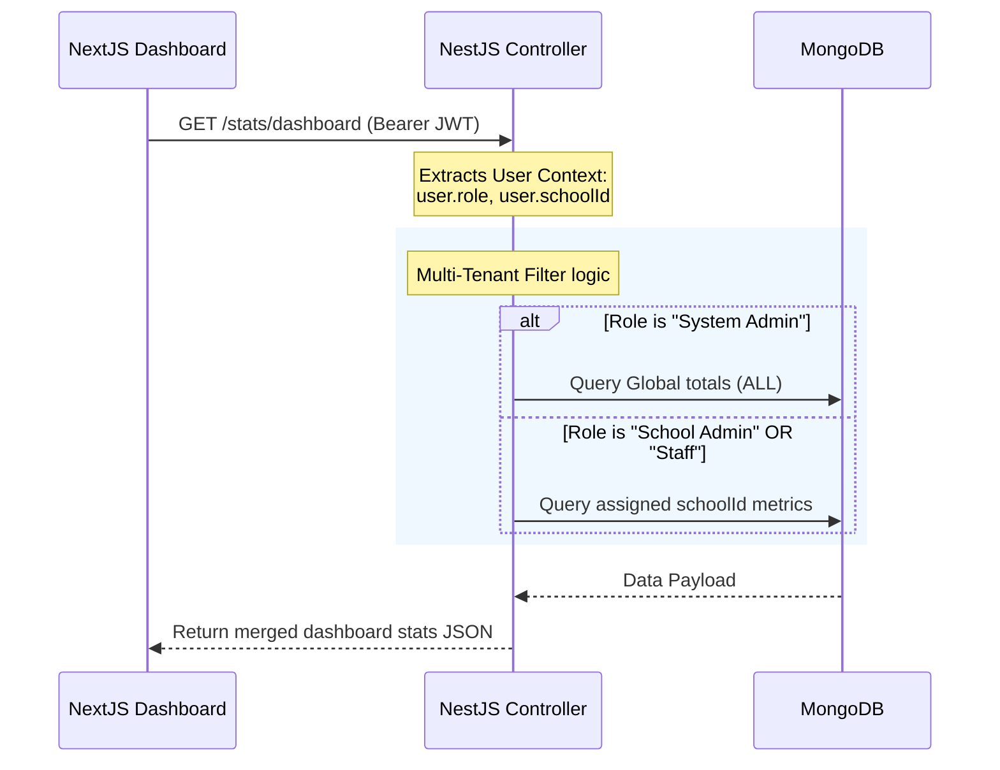

# SchoolSaaS ERP Platform - Architecture & Role-Based Access Summary

This document serves as a complete technical reference and architecture summary for the SchoolSaaS ERP Platform. It describes the backend multi-tenancy model, Role-Based Access Control (RBAC), database seeding structures, and the dynamic dashboard integration flow.

---

## 1. System Overview & Technology Stack

The platform is designed as a multi-tenant SaaS ERP portal where organizations/users manage assigned educational institutions.

* **Backend:** Built with NestJS (TypeScript), using Mongoose for MongoDB database access, and Passport/JWT for authentication.
* **Frontend:** Built with Next.js (clean architecture using App Router, React Client Components, and Context API).
* **Database:** MongoDB (utilizing a shared-database, document-level tenancy model via references).

---

## 2. Multi-Tenancy & User Roles (RBAC)

Rather than having schools log in directly as structural tenants, the platform employs a user-centric assignment model. Every human actor logs in with their credentials, and their portal experience is filtered based on their **Role** and **Assigned School ID**.

### Active User Roles

| Role (Backend) | Role (Frontend) | Display Name | Scope / Tenancy | Features & Access |
| :--- | :--- | :--- | :--- | :--- |
| **System Admin** | `Super Admin` | **Owner** | `ALL` (Global Access) | Manages all registered schools, platform subscriptions, payments, system audits, and global analytics. |
| **School Admin** | `Admin` | **Admin** | Specific `schoolId` | Manages the teachers, students, assignments, and profile metadata of their **assigned school**. |
| **Staff / Teacher** | `Sub Admin` | **Sub Admin** | Specific `schoolId` | Performs day-to-day administrative support helper tasks. Sub-admin permissions are restricted to view-only. |

---

## 3. Database Schema Design & Relationships

### Users Collection (`UserSchema`)
This collection holds all portal admins and assistants. 
```typescript
@Schema({ timestamps: true })
export class User {
  @Prop({ required: true })
  name: string;

  @Prop({ required: true, unique: true })
  email: string;

  @Prop({ required: true })
  password: string;

  @Prop({ required: true, default: 'Teacher' })
  role: string; // 'System Admin' | 'School Admin' | 'Staff' | 'Teacher'

  @Prop({ required: true, default: 'ALL' })
  schoolId: string; // Stores 'ALL' (for Owner) or the MongoDB ObjectId of their assigned school

  @Prop({ default: 'All Schools' })
  school: string; // Cached display name of the assigned school
}
```

### Schools Collection (`SchoolSchema`)
Holds administrative configurations, student/teacher enrollment counts, status, and subscription parameters.
```typescript
@Schema({ timestamps: true })
export class School {
  @Prop({ required: true })
  name: string;

  @Prop({ required: true, unique: true })
  code: string; // e.g., 'GIS-001'

  @Prop({ required: true })
  status: string; // 'Active' | 'Trial' | 'Expired' | 'Suspended'

  @Prop({ default: 0 })
  students: number; // Enrolled students count used for dashboard metrics

  @Prop({ default: 0 })
  teachers: number; // Enrolled teachers count used for dashboard metrics
}
```

---

## 4. Seeding & Local Authentication Details

Database seeding is managed by `src/seed.ts` in the NestJS backend. It clears the existing tables and populates baseline entries.

* **Seed command:** `powershell -ExecutionPolicy Bypass -Command "npm run seed"` (Backend directory)
* **Default Seeding Credentials (Password: `School@123`):**
  * **System Admin (Owner):** `owner@schoolsaas.in`
  * **School Admin (Assigned Greenfield School):** `priya.s@greenfield.edu.in`
  * **Teacher (Assigned Sunrise Public School):** `rahul.v@sunrisepublic.edu.in`

---

## 5. Dashboard Integration Flow

The main application dashboard fetches data from a single REST endpoint: `/stats/dashboard`.

### HTTP Request Flow


### Backend Statistics Service (`StatsService`)
The service aggregates and maps metrics based on the invoking user's scope:

```typescript
async getDashboardStats(schoolId?: string) {
  let totalSchools = 0;
  let activeSchools = 0;
  let studentsCount = 0;
  let teachersCount = 0;
  
  if (schoolId && schoolId !== 'ALL') {
    // 1. Localized school scope (Admin or Sub-Admin)
    const schoolObj = await this.schoolModel.findById(schoolId).exec();
    if (schoolObj) {
      studentsCount = schoolObj.students;
      teachersCount = schoolObj.teachers;
      if (schoolObj.status === 'Active' || schoolObj.status === 'Trial') activeSchools = 1;
      totalSchools = 1;
    }
  } else {
    // 2. Global application scope (Owner/System Admin)
    totalSchools = await this.schoolModel.countDocuments().exec();
    activeSchools = await this.schoolModel.countDocuments({ status: { $in: ['Active', 'Trial'] } }).exec();
  }

  const recentActivities = await this.getRecentActivities(5, schoolId);

  return {
    totalSchools,
    activeSchools,
    totalStudents: studentsCount,
    totalTeachers: teachersCount,
    recentActivities,
  };
}
```

### Frontend Binding (`src/app/dashboard/page.tsx`)
The frontend dashboard consumes this payload, extracting variables directly at the root level to format local UI stats labels:
```typescript
const totalSchools = data?.totalSchools !== undefined ? String(data.totalSchools) : '1,284';
const activeSchools = data?.activeSchools !== undefined ? String(data.activeSchools) : '942';
const totalStudents = data?.totalStudents !== undefined ? String(data.totalStudents) : '425.6K';
const totalTeachers = data?.totalTeachers !== undefined ? String(data.totalTeachers) : '18.7K';
```
If the user's role is not allowed full sidebar view (implemented using granular `hasModuleAccess` array mappings), Next.js dynamically adjusts the navigation to hide sensitive analytics, payment routes, settings, or audit databases.
