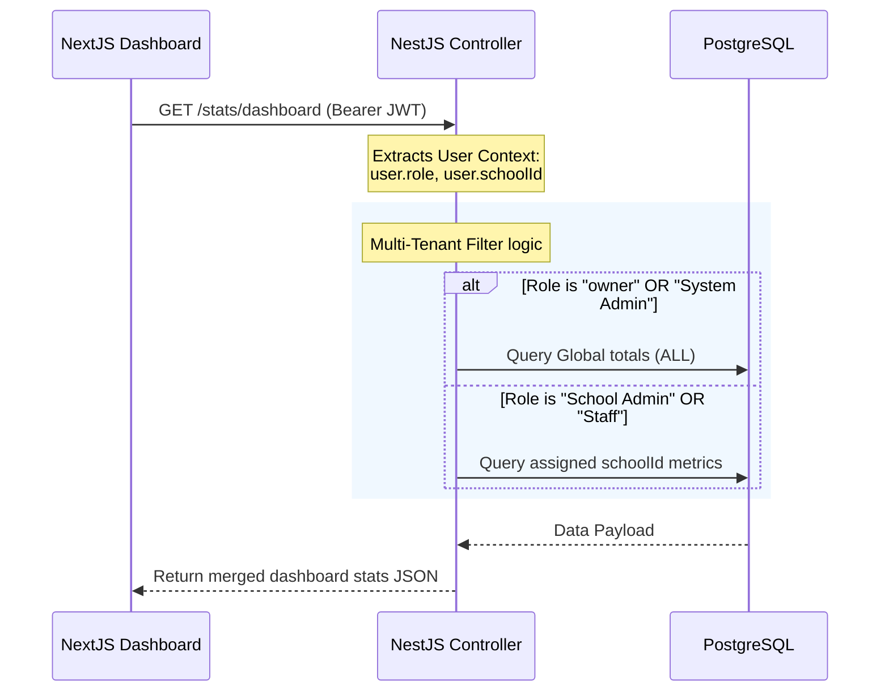

# SchoolSaaS ERP Platform - Architecture & Role-Based Access Summary

This document serves as a complete technical reference and architecture summary for the SchoolSaaS ERP Platform. It describes the backend multi-tenancy model, Role-Based Access Control (RBAC), database structures using Prisma, and the dynamic dashboard integration flow.

---

## 1. System Overview & Technology Stack

The platform is designed as a multi-tenant SaaS ERP portal where organizations and users manage assigned educational institutions.

* **Backend:** Built with NestJS (TypeScript), using Prisma ORM for PostgreSQL database access, and Passport/JWT for authentication.
* **Frontend:** Built with Next.js App Router, Tailwind CSS v4, React Client Components, and Context API for Authentication & Theme State Management.
* **Database:** PostgreSQL (utilizing a shared-database, row-level tenancy model via relational foreign keys).

---

## 2. Multi-Tenancy & User Roles (RBAC)

Rather than having schools log in directly as structural tenants, the platform employs a user-centric assignment model. Every human actor logs in with their credentials, and their portal experience is filtered based on their **Role** and **Assigned School ID**.

### Active User Roles

| Role (Backend) | Role (Frontend) | Display Name | Scope / Tenancy | Features & Access |
| :--- | :--- | :--- | :--- | :--- |
| **System Admin** / **owner** | `owner` | **Owner** | `ALL` (Global Access) | Manages all registered schools, platform subscriptions, payments, system audits, and global analytics. |
| **School Admin** | `Admin` | **Admin** | Specific `schoolUuid` | Manages the teachers, students, assignments, and profile metadata of their **assigned school**. |
| **Staff / Teacher** | `Sub Admin` | **Sub Admin** | Specific `schoolUuid` | Performs day-to-day administrative support helper tasks. Sub-admin permissions are restricted to view-only or limited mutations. |

---

## 3. Database Schema Design (Prisma)

The application has migrated to a strictly typed, relational model using Prisma ORM and PostgreSQL.

### Schools Table (`School`)
Holds administrative configurations, student/teacher enrollment counts, status, and subscription parameters.
This table holds all administrative configurations for the educational institutions registered on the platform. It stores basic details (like name, code, city, state), subscription plan information (Basic/Standard/Premium), current status (Trial/Active/Expired), and enrollment statistics (students and teachers count). This table acts as the primary anchor for multi-tenancy, as all other entities (users, tickets, activities) are linked back to a specific school record.

> [!NOTE]
> **Admin Table Deprecation:** Historically, school admins were placed in a separate `Admin` table. This has been refactored. The `Admin` table is now primarily reserved for legacy `System Admin` (owners) and fallback purposes. New school registrations exclusively utilize the `User` table for consistency.

---

## 4. Authentication Flow

The frontend relies heavily on JWT for session persistence.
- **Login Endpoint:** `/auth/admin-login` (or `/auth/login`).
- **Token Decoding:** The backend issues a JWT containing `{ id, email, role, schoolId, permissions }`.
- **Frontend Interceptor:** Axios is configured with a `TransformInterceptor` that automatically injects the `Bearer` token into headers and unwraps the `{ success: true, data: T }` envelope returned by the NestJS backend.

---

## 5. Dashboard Integration Flow

The main application dashboard fetches data from a single REST endpoint: `/stats/dashboard`.

### HTTP Request Flow

### Backend Statistics Service (`StatsService`)
The service calculates the required metrics dynamically. If the user is an Owner or System Admin, it uses Prisma's `count` functions to return the total and active global schools across the entire platform. If the user is a localized School Admin or Staff member, it executes a targeted `findUnique` query to fetch statistics (such as enrolled students and teachers) exclusively for their assigned institution. This guarantees that data boundaries are strictly enforced at the database query level based on the JWT token claims.

If the user's role does not have permission for certain routes, the frontend UI dynamically hides those sidebar links and restricts rendering of protected modules via the `hasModuleAccess` utility.
